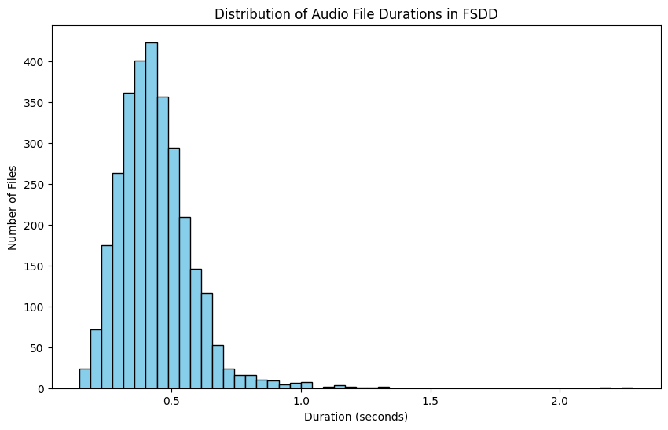
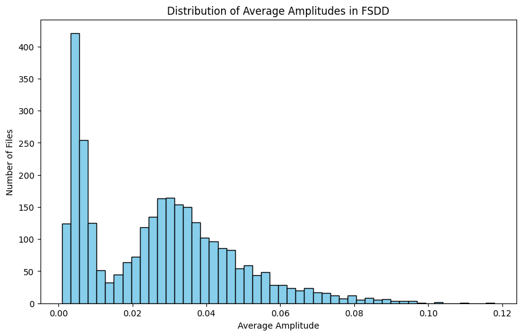

# Audio-Classification (Spoken Digits)

## 🎯 Goal
Classify audio recordings of spoken digits (0–9) based on extracted acoustic features.
---

## 🔍 Key Features

- **Speaker Diversity**: Includes recordings from multiple speakers with different genders, accents, and countries, all speaking English.
- **Feature Extraction**: Uses Mel-Frequency Cepstral Coefficients (MFCC), Chroma, and Spectrogram features for audio representation.
- **Dataset Size**: 3,000 audio samples (300 per digit).

---

## 📊 Data Description

| Feature         | Description                                      |
|----------------|--------------------------------------------------|
| `file_name`     | Audio file name                                 |
| `digit`         | Spoken digit label (0–9)                        |
| `speaker`       | Speaker identifier (e.g., george, yweweler)     |
| `sample_number` | Unique sample ID                                |
| `MFCC`          | MFCC features (array)                           |
| `Chroma`        | Chroma features (array)                         |
| `Spectrogram`   | Spectrogram features (array)                    |

### 🧑‍🎤 Speaker Metadata

| Speaker   | Gender | Accent      | Language |
|-----------|--------|-------------|----------|
| jackson   | male   | USA/neutral | English  |
| nicolas   | male   | BEL/French  | English  |
| theo      | male   | USA/neutral | English  |
| yweweler  | male   | DEU/German  | English  |
| george    | male   | GRC/Greek   | English  |
| lucas     | male   | DEU/German  | English  |

---

---

## 🧪 Methodology

### 🔹 Data Loading and Preprocessing
- Load audio files and extract MFCC, Chroma, and Spectrogram features.
- Normalize features to ensure consistency for model training.

### 🔹 Feature Engineering
- Extract and compile MFCC, Chroma, and Spectrogram features.
- Combine all features into a unified dataset ready for model ingestion.

### 🔹 Model Training
- Split dataset into training and testing sets.
- Train a deep learning model (e.g., using TensorFlow/Keras) to classify digits.

### 🔹 Evaluation
- Assess model performance using:
  - Accuracy
  - Precision
  - Recall
  - F1-score
- Visualize results using:
  - Confusion matrix
  - ROC curves

---

## 📊 Results and Findings

The following table summarizes the performance of various deep learning models (CNN and RNN) trained to classify spoken digits based on extracted audio features:

| Model        | Epochs | Train Accuracy | Validation Accuracy | Train Loss | Validation Loss |
|--------------|--------|----------------|----------------------|------------|------------------|
| CNN Model 1  | 10     | 0.935417       | 0.895000             | 0.617536   | 0.654126         |
| CNN Model 2  | 20     | 0.973333       | 0.951667             | 0.364210   | 0.758135         |
| CNN Model 3  | 5      | 0.989167       | 0.593333             | 0.048140   | 1.544981         |
| RNN Model 1  | 10     | 0.773438       | 0.770833             | 0.656908   | 0.634634         |
| RNN Model 2  | 20     | 0.865625       | 0.877083             | 0.385525   | 0.376532         |

---

### ✅ Conclusion

- **CNNs outperformed RNNs** overall in this experiment.
- **Model selection and regularization** play a critical role in achieving good generalization.
- Future work could involve experimenting with hybrid models (CNN + RNN) and adding dropout or batch normalization to further improve performance.

